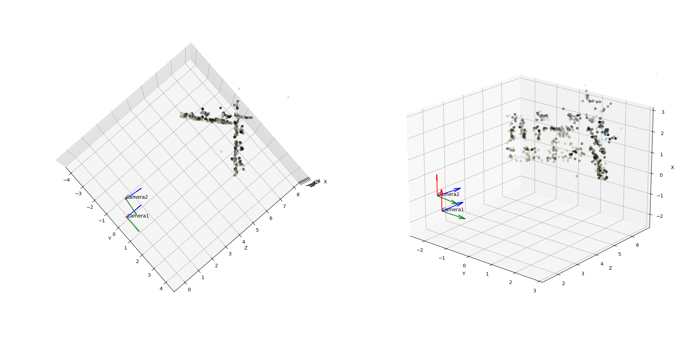

# 3D Reconstruction from Two View

Experimental code for 3D reconstruction from 2 images

## Environment setting

```bash
pip install pipenv  # If pipenv is not installed
cd <repository root path>
pipenv sync
```

## Usage

```bash
pipenv run python 3d_reconstruction_from_two_view.py
```




## Reference

- 金谷健一, 菅谷保之, 金澤靖. 3 次元コンピュータビジョン計算ハンドブック. 2016.
- 佐藤淳. コンピュータビジョン - 視覚の幾何学 -. 1999.
